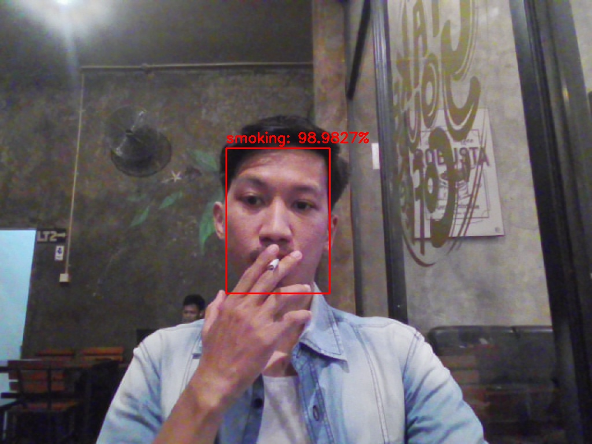

# Smoking Recognition by [Halip26](https://halip26.github.io/)

## Overview

This project aims to detect smoking in real-time using a webcam feed. It uses a pre-trained face detector model to identify faces in the video stream and a custom-trained smoking recognition model to determine whether the detected face is of a person who is smoking.

## Features

- Real-time face detection using OpenCV's deep learning-based face detector.
- Real-time smoking recognition using a custom-trained Keras model.
- Live video feed processing and display.
- Option to save the processed video frames with recognition results.

## Requirements

- Python 3.x
- OpenCV
- imutils
- numpy
- argparse
- pickle
- keras
- tensorflow

## Installation

1. Clone the repository:

    ```bash
    git clone https://github.com/yourusername/smoking-recognition.git
    cd smoking-recognition
    ```

2. Install the required packages:

    ```bash
    pip install -r requirements.txt
    ```

3. Download the face detection model files and place them in the `weights` directory:
    - `deploy.prototxt` (available [here](https://github.com/opencv/opencv/blob/master/samples/dnn/face_detector/deploy.prototxt))
    - `res10_300x300_ssd_iter_140000.caffemodel` (available [here](https://github.com/opencv/opencv/blob/master/samples/dnn/face_detector/res10_300x300_ssd_iter_140000.caffemodel))

4. Ensure you have the trained smoking recognition model (`smoking.model`) and the label encoder (`le.pickle`) in the `weights` directory.

## Usage

Run the script using the command:

```bash
python smoking_recognition.py --face_confidence 0.5
```

Arguments:

- `--face_confidence`: Minimum probability to filter weak detections. Default is 0.5.

## File Structure

- `smoking_recognition.py`: Main script to run the smoking recognition system.
- `weights/`: Directory containing the model weights and configuration files.
  - `deploy.prototxt`: Face detector model configuration.
  - `res10_300x300_ssd_iter_140000.caffemodel`: Face detector model weights.
  - `smoking.model`: Trained smoking recognition model.
  - `le.pickle`: Label encoder for the smoking recognition model.
- `images/output/`: Directory to save output images.

## Example Output

The system processes each frame of the video stream, detects faces, and determines if the person is smoking. The results are displayed on the video feed with labels and bounding boxes.



## License

This project is licensed under the MIT License - see the [LICENSE](LICENSE) file for details.

## Acknowledgements

- OpenCV for providing the face detection model and tools.
- Keras and TensorFlow for the deep learning framework.
- Imutils for simplifying video stream handling and image processing tasks.

Feel free to contribute to this project by submitting issues or pull requests.
